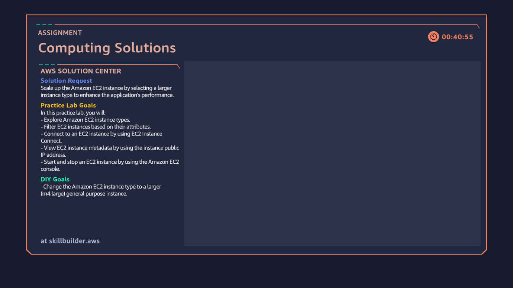
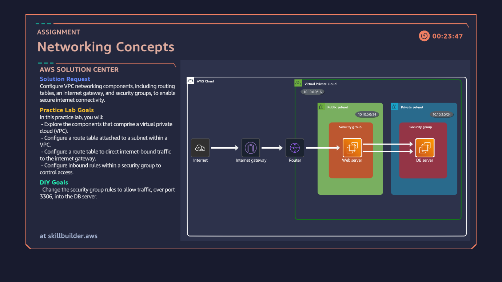
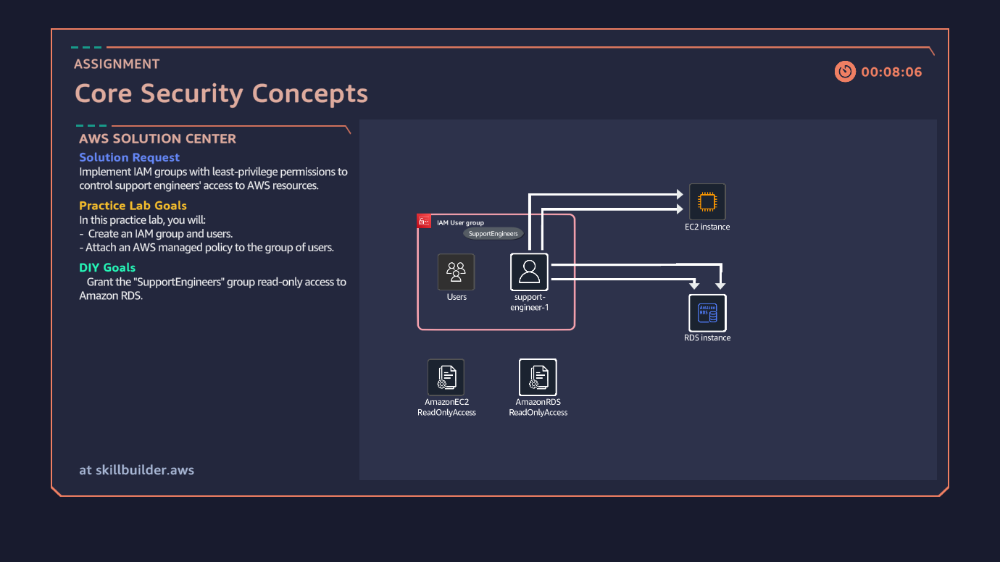
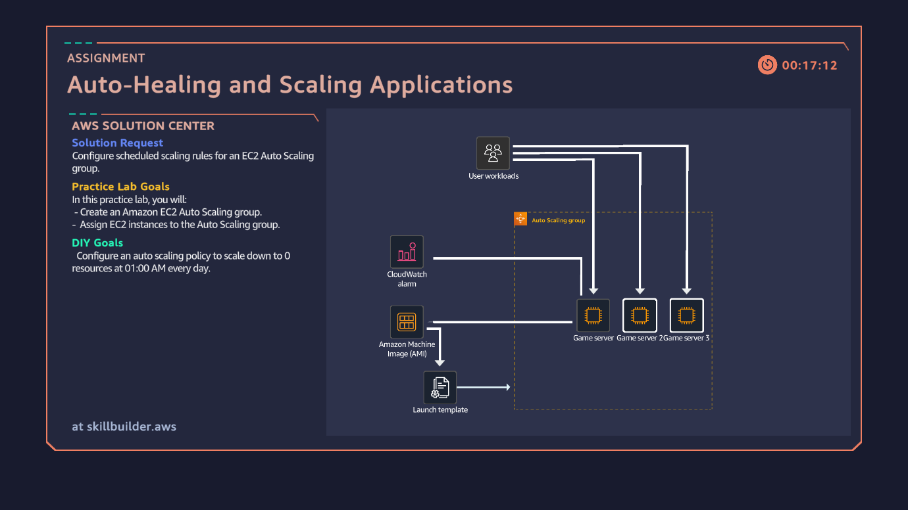
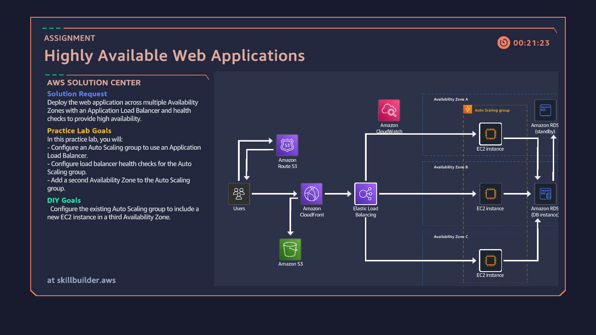

# AWS Cloud Quest (Cloud Parctitioner)

## 🚀 About Cloud Quest

Cloud Quest is an interactive learning platform by AWS that helps learners gain hands-on experience with AWS services, cloud concepts, and best practices.

It includes:  
- **Project Lab:** Guided exercises where you build and explore real cloud environments.  
- **Practice Missions:** Short, focused tasks to reinforce concepts and test your understanding.  
- **DIY Missions:** Independent challenges where you apply your knowledge to solve real-world scenarios.  

This repository contains my screenshots and progress for the Cloud Quest projects.

## 📝 Projects
### Project 1: Cloud Computing Essentials

### Project 2: Cloud First Steps

### Project 3: Computing Solutions

### Project 4: Networking Concepts

### Project 5: Databases in Practice

### Project 6: Connecting VPCs

### Project 7: Cloud Economics

### Project 8: File Systems in the Cloud

### Project 9: First NoSQL Database

### Project 10: Core Security Concepts

### Project 11: Auto-Healing and Scaling Applications

### Project 12: Highly Available Web Application

